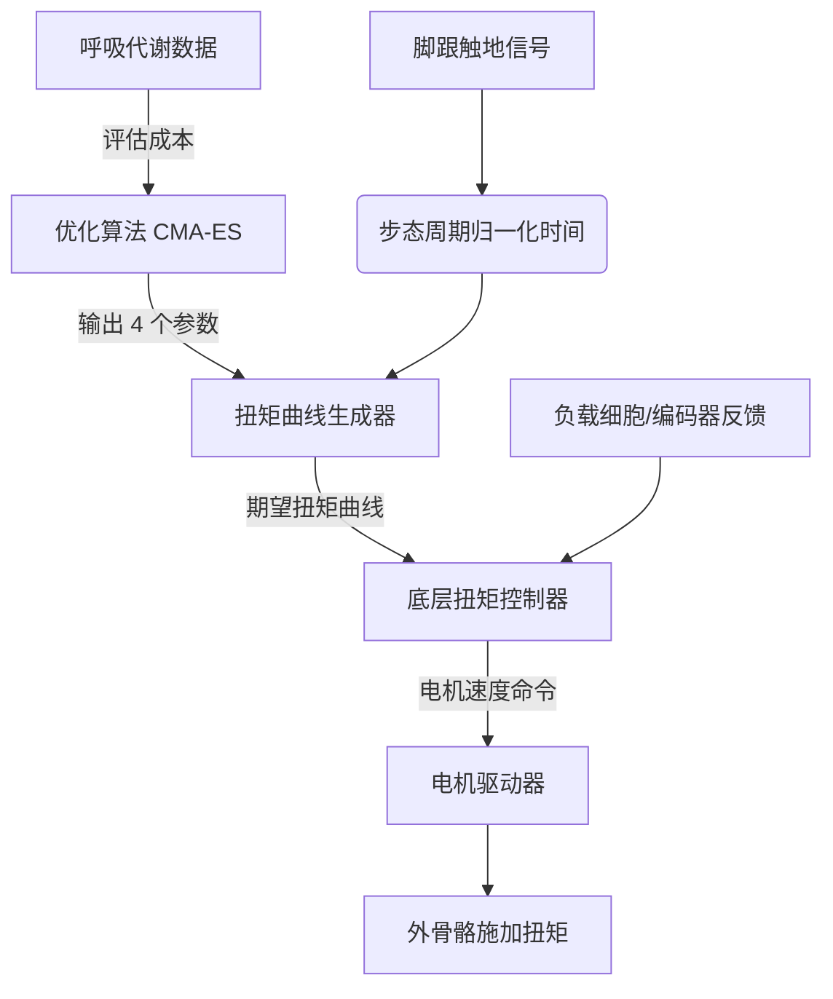

[[Human-in-the-Loop Optimization of Exoskeleton Assistance During Walking]]
根据补充材料（aal5054_zhang_sm.pdf），该外骨骼的控制逻辑分为两个层面：**上层优化逻辑**（寻找最佳参数）和**底层实时控制逻辑**（执行扭矩）。以下是详细的解说：

### 1. 控制逻辑架构 (Control Logic Architecture)

系统采用**分层控制**：
*   **上层（优化层）：** 使用 CMA-ES 算法，根据人的代谢成本自动调整控制参数。
*   **下层（实时层）：** 根据确定的参数生成扭矩曲线，并通过电机速度控制实现扭矩跟踪。

---

### 2. 输入 (Inputs)

控制系统的输入分为实时控制输入和优化算法输入：

#### A. 实时控制输入（用于生成扭矩曲线）
*   **步态事件信号：** 主要是**脚跟触地 (Heel Strike)** 信号，由鞋跟内的接触开关 (Contact Switch) 提供，标志着步态周期的开始（0%）。
*   **步态周期时间 (Stride Period)：** 在线估计当前的步态周期时长，用于将时间归一化。
*   **当前时间戳：** 相对于脚跟触地后的 elapsed time。
*   **传感器反馈（底层控制用）：**
    *   负载细胞 (Load Cell) 测量的实际扭矩。
    *   编码器 (Encoder) 测量的关节角度/电机位置。

#### B. 优化算法输入（用于调整参数）
*   **代谢率估计值 (Metabolic Rate)：** 通过呼吸气体分析系统（Oxycon Mobile）测量的摄氧量 ($VO_2$) 和二氧化碳产生量 ($VCO_2$)，经过一阶动力学模型拟合后得到的稳态代谢率估计值。

---

### 3. 输出 (Outputs)

#### A. 实时控制输出
*   **期望扭矩曲线 (Desired Torque Profile)：** 基于四个参数生成的“山形”扭矩曲线。
*   **电机速度命令 (Motor Velocity Commands)：** 底层控制器不直接控制电流/扭矩，而是向电机驱动器发送**速度命令**，通过比例控制 + 阻尼注入 + 迭代学习来实现扭矩跟踪。
    *   控制频率：500 Hz 生成命令。
    *   采样频率：5000 Hz 采集传感器数据。

#### B. 优化算法输出
*   **四个控制参数 (Control Parameters)：** 每一代优化后更新的参数集，用于定义下一阶段的扭矩曲线：
    1.  **峰值扭矩 ($\tau_p$)**：扭矩的最大值。
    2.  **峰值时间 ($t_p$)**：达到峰值扭矩的时刻（占步态周期的百分比）。
    3.  **上升时间 ($t_r$)**：扭矩从 onset 上升到峰值所需的时间。
    4.  **下降时间 ($t_f$)**：扭矩从峰值下降到 removal 点所需的时间。

---

### 4. 下发扭矩的时间 (Timing of Torque Delivery)

扭矩的下发严格遵循**步态周期 (Gait Cycle)**，具体逻辑如下：

*   **触发条件：** 仅在**站立相 (Stance Phase)** 施加扭矩，即脚接触地面时。
*   **时间归一化：** 所有时间参数均归一化为**步态周期的百分比 (% Stride)**，而非绝对秒数，以适应不同的行走速度。
*   **具体时间节点：**
    1.  **0% (脚跟触地 Heel Strike)：** 期望扭矩为 0 Nm。
    2.  **扭矩开启点 (Onset)：** 时间点为 $(t_p - t_r)$。此时扭矩开始从 2 Nm（为避免缆绳松弛 instability 设置的最小值）开始上升。
    3.  **峰值点 (Peak)：** 时间点为 $t_p$。此时达到设定的峰值扭矩 $\tau_p$。
        *   约束：通常在步态周期的 10% 到 50-55% 之间。
    4.  **扭矩移除点 (Removal)：** 时间点为 $(t_p + t_f)$。扭矩下降回 2 Nm。
    5.  **65% 步态周期：** 期望扭矩强制归零（通常在脚尖离地 Toe-off 之后）。
    6.  **摆动相 (Swing Phase)：** 一旦脚离开地面（通过脚跟开关或编码器判断），进入“零扭矩模式 (Zero-torque swing mode)"，保持缆绳松弛，不施加力。

*   **曲线形状：** 由两段**三次样条曲线 (Cubic Splines)** 组成，形成平滑的“山形”上升和下降沿，避免扭矩突变带来的不适。

### 5. 底层扭矩跟踪逻辑 (Low-level Torque Control)

为了确保上述期望扭矩能准确执行，底层采用了以下策略：
*   **控制方法：** 比例控制 (Proportional Control) + 阻尼注入 (Damping Injection) + **迭代学习 (Iterative Learning)**。
*   **迭代学习作用：** 利用行走的周期性，学习前几步的误差并进行前馈补偿，显著减少稳态误差。
*   **精度：** 稳态时扭矩跟踪误差可低至峰值扭矩的 **1%**。
*   **串联弹性：** 机械传动中使用了片簧 (Leaf Spring) 作为串联弹性元件，解耦电机惯量，提高扭矩跟踪的柔顺性和安全性。

### 总结流程图

这种控制逻辑的核心在于**不依赖复杂的人体模型**，而是通过参数化的简单曲线，结合人体在环的优化，找到最省能的助力时机和大小。