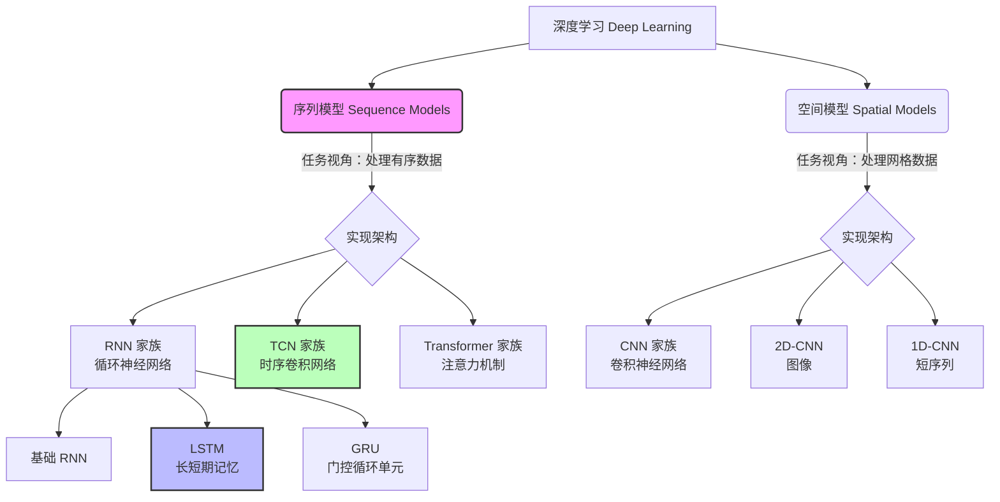
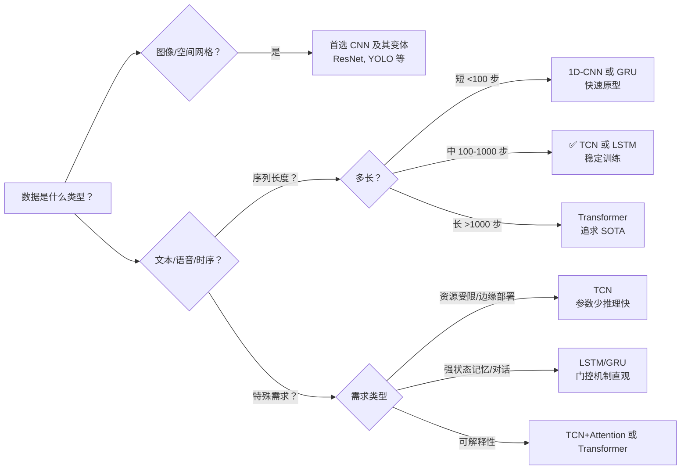

> **摘要**：本文档整理了深度学习中常见模型（RNN、LSTM、CNN、TCN）与任务类型（序列模型）之间的层次关系、核心原理、对比分析及选型指南。适用于快速回顾与架构选型参考。

---

## 📑 目录

1. [整体层次关系](#1-整体层次关系)
2. [核心概念解析](#2-核心概念解析)
3. [TCN 时序卷积网络详解](#3-tcn 时序卷积网络详解)
4. [模型对比分析](#4-模型对比分析)
5. [选型决策指南](#5-选型决策指南)
6. [代码实现示例](#6-代码实现示例)
7. [总结与口诀](#7-总结与口诀)

---

## 1. 整体层次关系

理解模型关系的第一步是区分**任务类型**与**网络架构**。



*   **序列模型 (Sequence Models)**：按**数据类型/任务**分类。处理文本、语音、时间序列等有序数据。
*   **RNN/LSTM/TCN/CNN**：按**网络结构**分类。是实现序列模型的具体工具。

---

## 2. 核心概念解析

### 2.1 序列模型 (Sequence Models)
*   **定义**：处理输入或输出为序列数据的机器学习模型总称。
*   **核心特点**：数据元素之间存在**顺序依赖关系**（时间步或位置）。
*   **典型任务**：机器翻译、语音识别、情感分析、股票预测。

### 2.2 RNN (循环神经网络)
*   **原理**：通过维护隐藏状态（Hidden State）来处理序列，信息沿时间步传递。
*   **结构**：`h_t = f(W * x_t + U * h_{t-1} + b)`
*   **优点**：天然适合序列建模，参数共享，可处理变长输入。
*   **缺点**：**梯度消失/爆炸**，难以学习长距离依赖（通常只能记住几步之前的信息）。

### 2.3 LSTM (长短期记忆网络)
*   **定位**：RNN 的改进版（Enhanced RNN）。
*   **核心机制**：引入**细胞状态 (Cell State)** 和 **三个门控**。
    *   🔓 **Forget Gate**：决定丢弃哪些旧信息。
    *   🔐 **Input Gate**：决定写入哪些新信息。
    *   🔍 **Output Gate**：决定输出哪些信息。
*   **优势**：有效缓解梯度消失，能记住数千时间步前的关键信息。
*   **应用**：语音识别、早期机器翻译、时间序列预测。

### 2.4 CNN (卷积神经网络)
*   **定位**：空间特征提取专家。
*   **核心操作**：卷积（提取局部特征）+ 池化（降维）。
*   **擅长数据**：网格结构数据（图像、视频帧）。
*   **序列应用**：1D-CNN 可用于短序列分类，但原生不擅长建模长距离时间依赖。

---

## 3. TCN 时序卷积网络详解

**TCN (Temporal Convolutional Network)** 是 CNN 思想的“时序特化版”，旨在用卷积的方式解决序列问题，兼顾并行性与长程依赖。

### 3.1 核心架构三要素

1.  **因果卷积 (Causal Convolution)** 🛡️
    *   **目的**：保证“不偷看未来”。
    *   **实现**：输出时刻 `t` 仅依赖输入时刻 `≤ t` 的信息。通过在输入左侧补零（Left Padding）实现。
2.  **空洞/扩张卷积 (Dilated Convolution)** 🔭
    *   **目的**：指数级扩大感受野，捕获长距离依赖。
    *   **机制**：卷积核采样时跳过某些点（扩张率 `d = 1, 2, 4, 8...`）。
    *   **效果**：少量层数即可覆盖很长序列（例如 10 层可达 1024 步感受野）。
3.  **残差连接 (Residual Block)** 🔗
    *   **目的**：解决深层网络梯度问题，允许网络堆叠得更深。
    *   **来源**：借鉴 ResNet 设计。

### 3.2 TCN 的优缺点
*   ✅ **优点**：
    *   **并行计算**：训练速度远快于 RNN/LSTM。
    *   **长程依赖**：通过空洞卷积有效捕捉。
    *   **梯度稳定**：反向传播路径短，不易消失。
    *   **内存效率**：参数与序列长度无关。
*   ❌ **缺点**：
    *   **推理缓存**：在线推理时需要缓存历史输入。
    *   **超长序列**：感受野受层数限制，极长序列不如 Transformer 灵活。

---

## 4. 模型对比分析

| 维度 | CNN (1D) | RNN / LSTM | TCN | Transformer |
| :--- | :--- | :--- | :--- | :--- |
| **计算方式** | ✅ 完全并行 | ❌ 时间步顺序计算 | ✅ 完全并行 | ✅ 完全并行 |
| **长程依赖** | ❌ 有限 (靠堆叠) | ⚠️ 中等 (LSTM 缓解) | ✅ 强 (空洞卷积) | ✅ 极强 (自注意力) |
| **梯度稳定性** | ✅ 高 | ⚠️ 低 (易消失) | ✅ 高 (残差连接) | ✅ 高 (归一化 + 残差) |
| **推理速度** | ✅ 快 | ❌ 慢 (串行) | ✅ 快 | ⚠️ 中 (长序列慢) |
| **内存占用** | ✅ 低 | ✅ 低 | ✅ 低 | ❌ 高 (注意力矩阵 O(n²)) |
| **典型场景** | 短序列分类 | 强状态依赖任务 | 时序预测、音频 | NLP、超长序列 |

---

## 5. 选型决策指南



### 快速建议表

| 任务场景 | 推荐模型 | 理由 |
| :--- | :--- | :--- |
| **图像分类/检测** | CNN (ResNet, VGG) | 空间特征提取最强 |
| **短文本分类** | 1D-CNN / Bi-LSTM | 速度快，效果足够 |
| **时间序列预测** | **TCN** / LSTM | TCN 训练更快，LSTM 更成熟 |
| **机器翻译/生成** | Transformer (BERT, GPT) | 长程依赖建模能力最强 |
| **语音识别** | LSTM / Transformer | 序列建模经典方案 |
| **边缘设备部署** | **TCN** / 量化 LSTM | 计算密集，易于加速 |

---

## 6. 代码实现示例

### 6.1 TCN 核心块 (PyTorch)

```python
import torch.nn as nn

class TCNBlock(nn.Module):
    def __init__(self, in_ch, out_ch, kernel_size=3, dilation=1):
        super().__init__()
        # 因果卷积 padding 计算
        padding = (kernel_size - 1) * dilation 
        self.conv1 = nn.Conv1d(in_ch, out_ch, kernel_size, 
                              padding=padding, dilation=dilation)
        self.conv2 = nn.Conv1d(out_ch, out_ch, kernel_size,
                              padding=padding, dilation=dilation)
        # 移除右侧填充以保证因果性
        self.chomp = lambda x: x[:, :, :-padding] if padding > 0 else x  
        self.relu = nn.ReLU()
        self.dropout = nn.Dropout(0.2)
        # 残差连接：维度匹配用 1x1 卷积
        self.residual = nn.Conv1d(in_ch, out_ch, 1) if in_ch != out_ch else nn.Identity()
    
    def forward(self, x):
        out = self.relu(self.chomp(self.conv1(x)))
        out = self.dropout(self.chomp(self.conv2(out)))
        return self.relu(out + self.residual(x))  # 残差连接

# 堆叠多层，扩张率指数增长：[1, 2, 4, 8, ...]
tcn = nn.Sequential(*[
    TCNBlock(1, 32, dilation=2**i) for i in range(5)  # 5 层，感受野=63
])
```

### 6.2 LSTM 核心使用 (PyTorch)

```python
import torch.nn as nn

class LSTMModel(nn.Module):
    def __init__(self, input_size, hidden_size, num_layers):
        super().__init__()
        self.lstm = nn.LSTM(input_size, hidden_size, num_layers, batch_first=True)
        self.fc = nn.Linear(hidden_size, 1)
        
    def forward(self, x):
        # x shape: (batch, seq_len, input_size)
        out, _ = self.lstm(x)
        # 取最后一个时间步的输出
        return self.fc(out[:, -1, :])
```

---

## 7. 总结与口诀

### 核心关系总结
1.  **序列模型**是“要做什么”（任务类别），**RNN/LSTM/CNN/TCN** 是“怎么做”（实现工具）。
2.  **RNN** 是循环网络的“基础款”，**LSTM** 是它的“增强续航版”（解决梯度消失）。
3.  **CNN** 专注“空间特征”，**RNN 家族** 专注“时间依赖”。
4.  **TCN** 是 CNN 思想在时序上的进化，用**并行卷积**替代**串行循环**，兼顾效率与长程依赖。

### 记忆口诀
> 🔹 序列任务看顺序，RNN  LSTM  是兄弟。  
> 🔹 梯度消失 LSTM  解，门控机制记长远。  
> 🔹 卷积本是空间王，TCN  改时序强。  
> 🔹 并行计算 TCN  快，Transformer  长序列霸。  
> 🔹 实际应用混着用，场景适配效果佳。

---
*文档生成日期：2023-10-27*
*适用领域：深度学习、自然语言处理、时间序列分析*
```